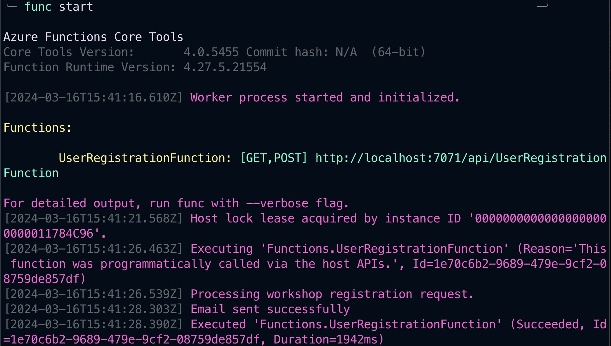
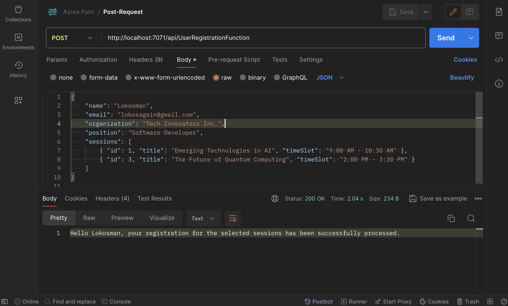
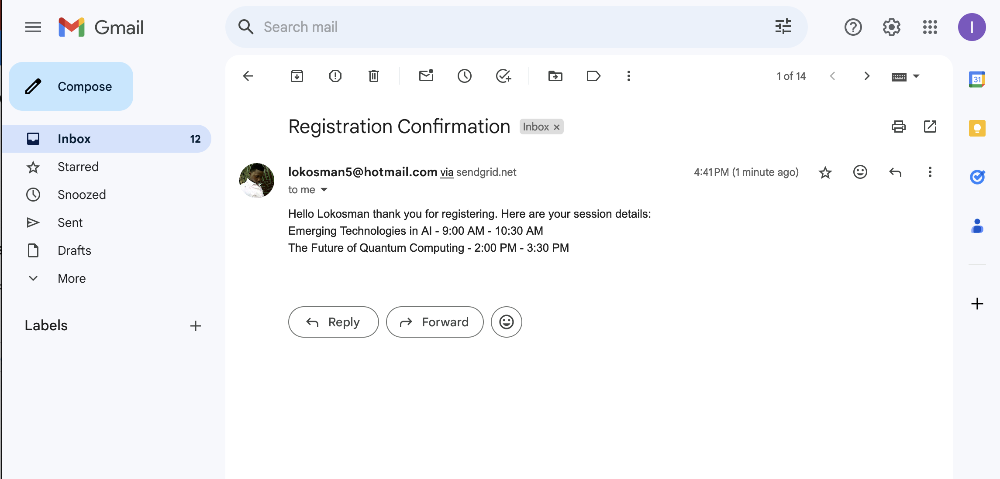
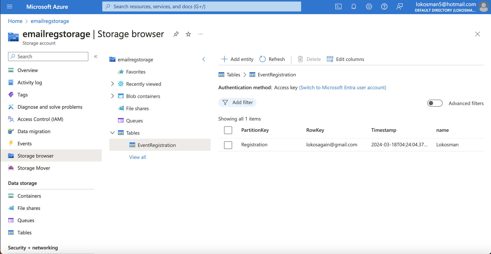

# Event Registration Confirmation Email Function





This Azure Function App is designed to automatically send confirmation emails to users when they register for an event. It utilizes the SendGrid Email API to manage and send emails. The application is triggered by HTTP requests, allowing for easy integration with web.

## Features

- Email confirmation upon event registration
- Integration with SendGrid Email API for reliable email delivery
- Customizable email content based on event details and user information
- Validation of registration details, including session selection

## Setup

1. **Clone the repository** to your local machine or Azure development environment.
2. **Install dependencies** by running `npm install` in the project directory. Ensure `@sendgrid/mail` is included in your `package.json`.
3. **Configure environment variables** by creating a `.env` file in the root of your project and adding your SendGrid API key: SENDGRID_API_KEY=your_sendgrid_api_key_here

## Usage

To trigger the function and send an email:

1. **Make an HTTP POST request** to your function's URL which is `http://localhost:7071/api/UserRegistrationFunction` with the registration details in the body.
2. The function validates the registration details, sends a confirmation email to the user, and returns a confirmation message.

Example request body:

```json
{
    "name": "Lokosman",
    "email": "lokosagain@gmail.com",
    "organization": "Tech Innovators Inc.",
    "position": "Software Developer",
    "sessions": [
        { "id": 1, "title": "Emerging Technologies in AI", "timeSlot": "9:00 AM - 10:30 AM" },
        { "id": 3, "title": "The Future of Quantum Computing", "timeSlot": "2:00 PM - 3:30 PM" }
    ]
}
```

## Contributing

Contributions to improve the function are welcome. Please follow the standard Git workflow - fork, make your changes, and submit a pull request

## License

MIT License - Feel free to use and modify the code for your projects.